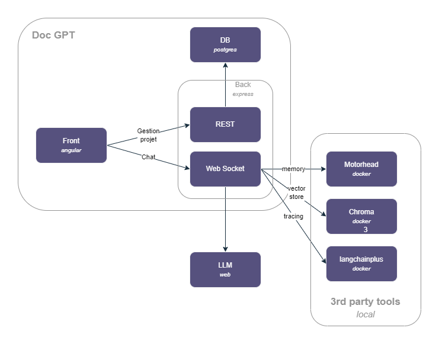

# DOC-GPT

DOC-GPT est une solution permettant à un utilisateur de traiter différents use case à l'aide de Large Language Models (LLM).
Elle met à disposition de l'utilisateur de créer ses propres projets, y ajouter au besoin des documents et d'y accrocher différents types de conversation selon son besoin.

Parmi les premiers use cases:

- Conversatrion simple type chat-gpt
- Chat with your data: utilisation de source de donnée personnalisée (fichiers txt, pdf, etc.)
- Résumé de document

La solution comprend différents composants:


- frontend: ui sous Angular
- backend: server express avec des
  - web service Rest pour la partie gestion (projet, documents, etc.) et des
  - services web socket pour la partie chat
  - basée sur Langchain pour l'interaction avec les LLM
- database: db pour la partie gestion sous postgresql
- chromadb: gestion de vector store
- motorhead: gestion de la mémoire des conversations

## Usage dev

- Copier .env.dev.example, renommer en .env.dev et mettre sa clé d'api OpenAI
- Lancer la stack chromaDb, LightHouse, LangchainPlus et Motorhead

```
npm run stack:dev
```

- Installer les dépendences du front et le démarrer

```
npm i
npm run frontend:dev
```

- Installer les dépendences du back et le démarrer

```
npm i
npm run backend:dev
```

## Références

https://js.langchain.com/docs/modules/indexes/
https://github.com/mayooear/gpt4-pdf-chatbot-langchain
