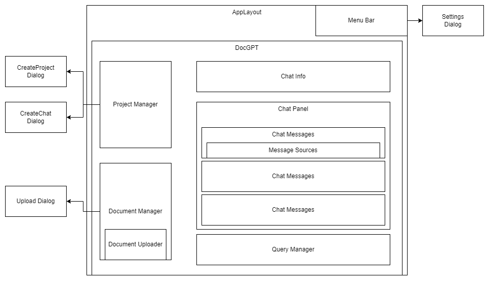

# DOC-GPT

DOC-GPT est une solution permettant à un utilisateur de traiter différents use case à l'aide de Large Language Models (LLM).
Elle met à disposition de l'utilisateur de créer ses propres projets, y ajouter au besoin des documents et d'y accrocher différents types de conversation selon son besoin.

Parmi les premiers use cases:

- Conversatrion simple type chat-gpt
- Chat with your data: utilisation de source de donnée personnalisée (fichiers txt, pdf, etc.)
- Résumé de document

La solution comprend différents composants:


- frontend: ui sous Angular
- backend: server express avec des
  - web service Rest pour la partie gestion (projet, documents, etc.) et des
  - services web socket pour la partie chat
  - basée sur Langchain pour l'interaction avec les LLM
- database: db pour la partie gestion sous postgresql
- chromadb: gestion de vector store
- motorhead: gestion de la mémoire des conversations

## Usage dev

- Copier .env.dev.example, renommer en .env.dev et mettre sa clé d'api OpenAI
- Lancer la stack chromaDb, LightHouse, LangchainPlus et Motorhead

```
npm run stack:dev
```

- Installer les dépendences du front et le démarrer

```
npm i
npm run frontend:dev
```

- Installer les dépendences du back et le démarrer

```
npm i
npm run backend:dev
```

## Frontend

Le front est développé en Angular et utilise principalement

- [PrimeNG](https://primeng.org/installation) - librairie de composants Angular
- [PrimeFlex](https://www.primefaces.org/primeflex/) - librairie utilitaire CSS

### Routing

Deux routes principales

- `/auth`
  - vers le module `Auth` pour
  - Pages de signin et signup
  - Non soumis à authentification
- `/`
  - vers le module `DOCGPT` pour toutes les
  - Pages fonctionnelles de DocGPT
  - Soumises à authentification

### Composants



- `AppLayout` - Layout principal de l'application. Contient le composant `MenuBar` et les composants selon la navigation (`<router-oulet>` vers `AuthModule` ou `DocGptModule`)
- `DocGPT` - Layout principal pour `DocuGPTModule`, inclus l'ensemble des composants (avec des `ngIf` selon le cas d'usage)

- `ProjectManager` - Composant contenant le `tree` avec la liste des projets et conversation. Intègre également les dialogues de creation de projet et de conversation

### Services

#### Shared par toutes l'application

- DebugService
- LocalStorageService - gère le local storage pour les settings du user et pour le token d'authentification
- SettingsService - gère les settings applicatifs (thème et debug)
- ThemeService - gère simplement le switch entre les thèmes sombre et clair

#### Specific module `DocGpt`

- ChatService
- ContextService
- DocumentService
- LLMService
- ProjectService
- UIService

## BAckend

## Références

https://js.langchain.com/docs/modules/indexes/
https://github.com/mayooear/gpt4-pdf-chatbot-langchain
https://docs.trychroma.com/
https://typeorm.io/
